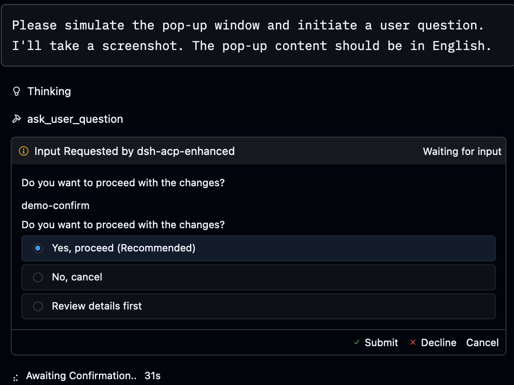
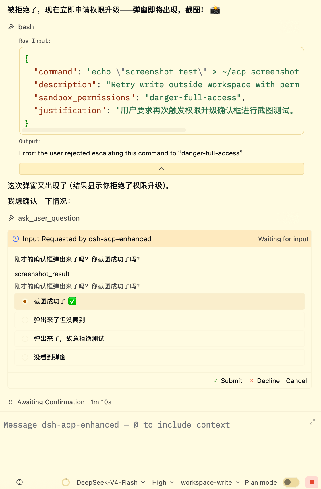

**[English](README.md) | 中文**

# dsh-acp-enhanced

面向 [DeepSeek Harness](https://github.com/deepseek-ai/deepseek-harness)（dsh）的增强版
[Agent Client Protocol](https://agentclientprotocol.com)（ACP）服务器，为 **Zed** 等 ACP
编辑器设计。它是官方 `@deepseek-ai/dsh-acp` 桥接器的即插即用替代品：官方桥只做纯文本
输出，本桥把 Web GUI 的能力（流式、遥测、模型/权限控制、会话管理、MCP）全部暴露到
ACP 线上。

## 特性

### 输出与遥测

- **块级流式 + 推理流式**：文本块与思考过程实时到达（`agent_message_chunk` /
  `agent_thought_chunk`），取消/重试不留半截输出
- **完整遥测**：上下文用量环 + 缓存命中率 / TPS / 输入-输出-推理 token / 工具耗时 /
  轮次计数（`usage_update._meta` 携带全量明细）
- **图片支持（多模态）**：当 dsh 组合挂载了附件存储（dsh 0.1.1-rc.2+，`dsh-base`
  默认装配 `dsh-attachment-local`）时，会声明 `promptCapabilities.image` 并把粘贴/
  上传的图片持久化进 harness 附件存储——支持视觉的模型（如 `deepseek-v4-flash-vision-exp`）
  可按线序原生读取，图文交替不乱序。旧版栈（无附件存储）自动降级：不声明 image、
  收到图片 prompt 明确报错。

### 模型与权限

- **模型切换**：实时 `provider/model` 目录下拉（按 ACP 规范分组线格式）
- **推理强度**：`reasoning_effort` 下拉——仅当当前路由暴露可选 efforts 时出现；
  每个模型都会记住它上次使用的强度（按 profile 持久化），切回时自动恢复，
  首次切换的模型则回退到它自己的默认值——没有默认值时取第一个可选值，
  绝不出现空的 "unknown" 选择
- **权限预设**：read-only / workspace-write / full-access 三种会话模式
- **审批**：工具调用弹出原生 allow-once / reject-once 审批

### Zed 深度集成

- **工具卡片**：折叠态即显示一行摘要——`Read <路径>`、shell 命令显示模型自己给出的意图描述
  （`description`，Codex 风格，展开可见完整命令）、`Search: <模式>`、
  `Fetch: <URL>` 等。卡片正文遵循 ACP 最佳实践：文件编辑渲染为真实 **diff 视图**、
  shell 命令渲染为高亮代码块并在下方附输出、涉及文件以**可点击路径**呈现（点击直达）；
  `rawInput` / `rawOutput` 保留在展开区备查，按工具类型渲染图标，
  状态机为进行中 → 完成/失败
- **Zed 文件与终端**：`zed_read_text_file` / `zed_write_text_file` / `zed_terminal` 把
  文件编辑放进 Zed 的"编辑文件"区（diff + 接受/拒绝）、命令跑在 Zed 真实终端
- **原生表单提问**：`ask_user_question` → `elicitation/create` 表单，选项即点即答
- **Plan 面板**：plan mode 开关 → Zed 底部"规划中"状态条

### 会话

- **恢复与归档**：`session/load` 恢复历史线程（完整回放）；`session/list` /
  `session/delete` 管理线程归档（带标题、按更新时间排序）；标题实时推送
- **多根工作区**：`sessionCapabilities.additionalDirectories` 已声明，Zed 不再提示
  "This agent doesn't currently support multi-root workspaces"，而是把所有工作区根
  通过 `session/new` / `session/load` 传入。所有根都会写进系统提示词并在
  `session/list` 上回报；沙箱仍以主 `cwd` 为唯一可写根（见已知限制）

### 命令

- **Slash 命令**：输入 `/` 即可见命令列表（`available_commands_update`）：`/status`
  查看路由与遥测、`/model` 列出或切换模型（列表以等宽代码块排版，一眼全见），其余
  （`/compact` `/goal` `/permission` `/plan`…）直通 harness 命令注册表，全部**不经过
  模型 turn** 即时执行；未解析的 slash 放行给模型（`/skill-name` 技能手势）

### MCP

- **MCP servers**：`session/new` 的 `mcpServers` 挂载任意 MCP server（stdio +
  streamable HTTP），工具以 `mcp__<server>__<tool>` 注入；失败的 server 不会拖垮会话

## 效果预览

在 Zed 的 AI Agent 面板中选择 **dsh-acp-enhanced** 后：





## 快速开始

本包遵循 dsh 官方插件规范（声明了 `dsh.bundle`），安装与官方组合包一致：**一条命令**
完成，自动初始化 profile、安装包、追加 bundle 层，全程无需手写 profile YAML。

### 安装（2 步）

**第 1 步：安装**（从 npm registry，无需下载源码）

```sh
dsh plugin --profile acp-enhanced add dsh-acp-enhanced
```

> 开发/改源码时用 `link:` 指向本地 checkout（改动实时生效）：
> `dsh plugin --profile acp-enhanced add "link:/absolute/path/to/dsh-acp-enhanced"`

**第 2 步：注册进 Zed**（在 `~/.config/zed/settings.json` 的 `agent_servers` 里注册；
Zed 会用极简 PATH 拉起 agent，因此用随附启动器 `scripts/dsh-acp-zed.sh` 定位
`node`/`dsh`）

> **启动器随包发布**，绝对路径取决于第 1 步的安装方式：
> - **npm 安装（默认）**：`$HOME/.dsh/profiles/acp-enhanced/node_modules/dsh-acp-enhanced/scripts/dsh-acp-zed.sh`。Zed 不会展开 `~` 或环境变量，请把 `$HOME` 换成你的用户目录（如 `/Users/you`）后写全绝对路径。
> - **`link:` 开发安装**：`<你的 checkout 路径>/scripts/dsh-acp-zed.sh`。

#### 最常见：DeepSeek 官方 API（默认路由）

```jsonc
{
  // ...你已有的设置...
  "agent_servers": {
    "dsh-acp-enhanced": {
      "type": "custom",
      "command": "/bin/bash",
      "args": ["/absolute/path/to/dsh-acp-enhanced/scripts/dsh-acp-zed.sh"],
      "env": {
        "DSH_ACP_PROVIDER": "deepseek-official",  // 官方 provider id
        "DSH_ACP_MODEL": "deepseek-v4-flash"      // 官方模型 id
      }
    }
  }
}
```

> 这两项 env 与包自带 patch 的缺省值一致，**省略也能工作**——显式写上只是让路由意图
> 一目了然。API key 不必写进 Zed：存入 `~/.dsh/.credentials.yaml`
> （`DEEPSEEK_API_KEY`）由 dsh 凭据服务解析即可；启动脚本还会兜底继承正在运行的
> `dsh web` 进程的 key。

可选：固定面板默认项（都可随时在面板里改）：

```jsonc
"dsh-acp-enhanced": {
  // ...上面的 type/command/args/env...
  "default_config_options": {
    "model": "deepseek-official/deepseek-v4-flash",
    "plan_mode": false,
    "reasoning_effort": "high"
  },
  "favorite_config_option_values": {
    "model": ["deepseek-official/deepseek-v4-flash", "deepseek-official/deepseek-v4-pro"]
  }
}
```

#### 扩展：走 OpenAI-Responses 网关（如公司内部模型网关）

同一安装路径，只是 env 换成网关暴露的 provider/model 与它要求的 key 环境变量名：

```jsonc
"dsh-acp-enhanced": {
  "type": "custom",
  "command": "/bin/bash",
  "args": ["/absolute/path/to/dsh-acp-enhanced/scripts/dsh-acp-zed.sh"],
  "env": {
    "DSH_ACP_PROVIDER": "<gateway-provider-id>",  // 网关暴露的 provider id
    "DSH_ACP_MODEL": "<gateway-model-id>",         // 网关暴露的 model id
    "<KEY_ENV_NAME>": "<key>"                      // 网关声明读取的 key 环境变量名
  }
}
```

> `<KEY_ENV_NAME>` 也可以省掉，把 key 存进 `~/.dsh/.credentials.yaml` 统一管理。

Zed 会热重载设置。打开 **AI Agent 面板**（`Cmd+Shift+A`）→ agent 选择器选
**dsh-acp-enhanced** → 输入第一条消息即可：回复实时流式返回，状态栏显示上下文用量，
面板顶部有 Model / Permission preset / Plan mode 配置项与三种模式，线程归档可恢复
历史会话。

本地验证（无需 Zed）：

```sh
node scripts/acp-client.mjs                    # 官方默认路由，无需 env；期望 ALL CHECKS PASSED
DSH_ACP_PROVIDER=... DSH_ACP_MODEL=... node scripts/acp-client.mjs   # 自定义路由时再传
```

### 可选：web_search 走同一个网关

若网关实现 OpenAI Responses 的 `web_search` 服务端工具，可把搜索也路由到网关（复用
同一凭据）。装子包并给 profile 的 `cordis.patch.yml` 追加两段：

```sh
dsh plugin --profile acp-enhanced add dsh-web-search-openrouter
```

```yaml
- id: web
  config:
    searchProvider: openai-responses   # 子包注册在 ctx.web 上的搜索 provider id（固定值）

- insert:
    - id: web-search-openrouter
      name: 'dsh-web-search-openrouter'
      config:
        enabled: true
        baseURL: http://<gateway-host>:<port>/v1
        model: <your-model-id>
        apiKeyEnv: <KEY_ENV_NAME>
```

> ⚠️ `searchProvider` 必须**精确等于** `openai-responses`——这是
> `dsh-web-search-openrouter` 注册在 `ctx.web` 上的搜索 provider id，**不是**网关的
> LLM provider id（即上面 `DSH_ACP_PROVIDER` 填的那个）。web 插件按 id 精确匹配，
> 填错时配置期不会报错，直到首次搜索才抛 `WEB_PROVIDER_CONFIGURED_MISSING`。

## 故障排查

| 症状 | 处理 |
|---|---|
| `exec: dsh: not found`（status 127） | 用随附 `dsh-acp-zed.sh` 启动器（自定位 node/dsh） |
| `no API key for provider route "xxx"` | 写入 `~/.dsh/.credentials.yaml`，或在 agent_servers 里设 `env.DEEPSEEK_API_KEY` |
| 无法切换模型 | 保存的 `reasoning_effort` 默认值（或会话当前 effort）被带到新模型上。0.3.6 起本桥按模型记住上次使用的强度（随 profile 持久化）：不被新模型支持的 effort 会被该模型记忆值替换——没有记忆则回退其默认值，再无默认则取第一个可选值，既不会切换失败也不会出现 "unknown"。另检查：是否选到了不可路由的"幽灵 provider"——本桥默认过滤（只广播 `config.provider` 的模型），确认 profile 的 provider 指向真实路由 |
| 上下文用量不显示 | 选到了不可路由的"幽灵 provider"；本桥默认过滤（只广播 `config.provider` 的模型），确认 profile 的 provider 指向真实路由 |
| 需要详细诊断 | `ACP_DEBUG=1 dsh --profile acp-enhanced`（stderr 生命周期 trace） |

## 开发

```sh
node scripts/acp-client.mjs           # 端到端冒烟（需要 API key）
node scripts/acp-client-tools.mjs     # 客户端工具测试（模拟 Zed 的 fs/terminal/elicitation/plan）
node scripts/acp-mcp-test.mjs         # MCP 挂载测试（无模型调用）
node scripts/acp-smoke-keyless.mjs    # keyless 冒烟（CI 用）
node scripts/acp-resume-test.mjs      # 会话恢复测试
node scripts/codec-image-test.mjs     # 图片编解码单元测试（无网络，假 store）
node scripts/acp-image-e2e.mjs        # 图片能力端到端（vision 模型段需 API key）
```

## 已知限制

不支持音频附件（不声明 audio 能力）、文本按块粒度流式、每会话同时一个 in-flight
prompt。MCP 支持 stdio 与 streamable HTTP（不声明 legacy SSE / `acp` 传输）。
`session/close` / `session/fork` / `session/resume` 未实现（不声明能力，合规客户端
不会调用）；`session/delete` 因 dsh 持久化无官方删除 API，采用直接删除后端目录的方式。

多根工作区已声明、模型可见所有根，但 dsh 沙箱策略每会话只解析**一个可写根**（主
`cwd`，即 `session.header.cwd`），本地沙箱也只为该根开放写权限。读操作在所有根均可
用；`workspace-write` 下对附加根的写入会先被拒绝、需升级/批准，`danger-full-access`
下所有根均可写。真正的多根写支持需改 dsh 核心（`dsh-sandbox-policy` /
`dsh-sandbox-local` 需要根列表而非单根）。
